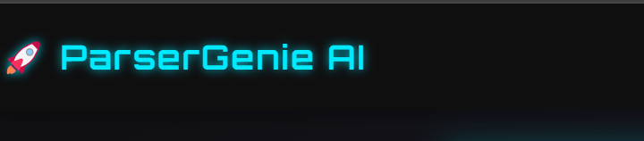
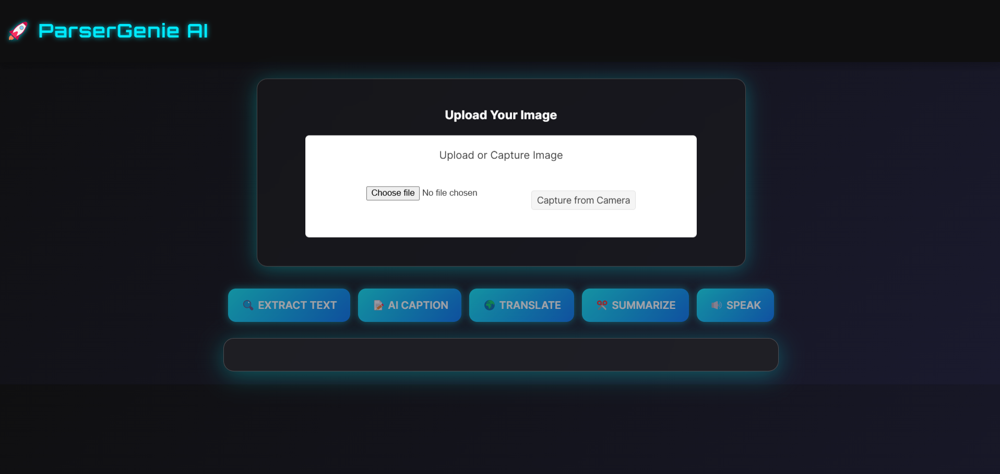
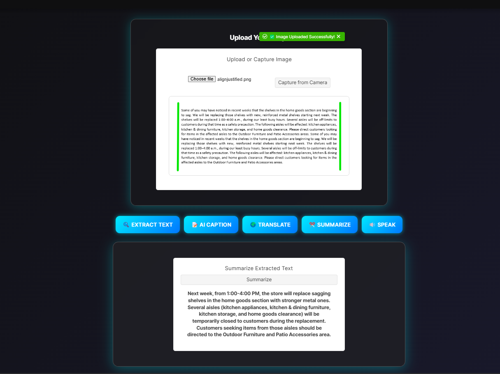
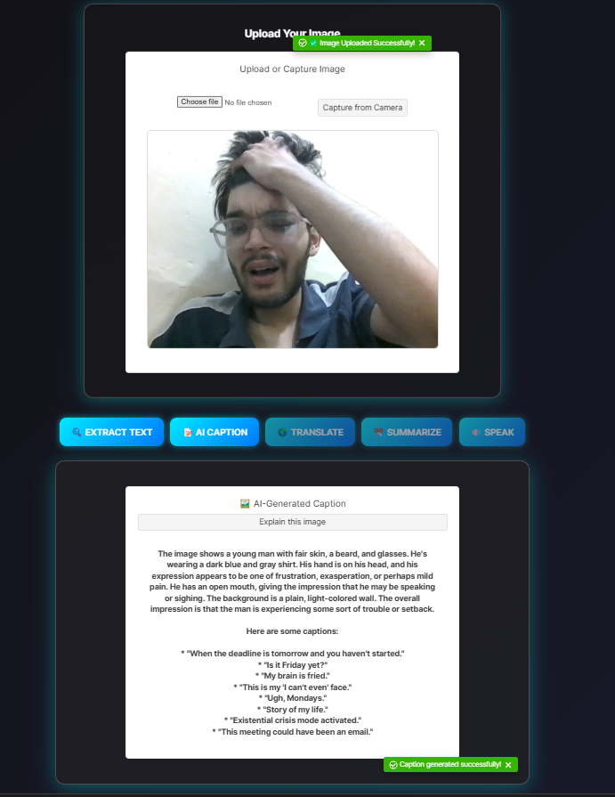
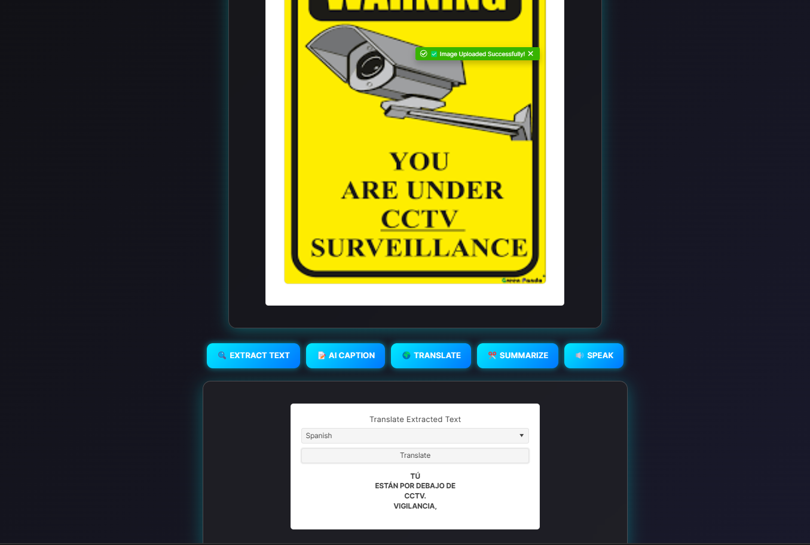
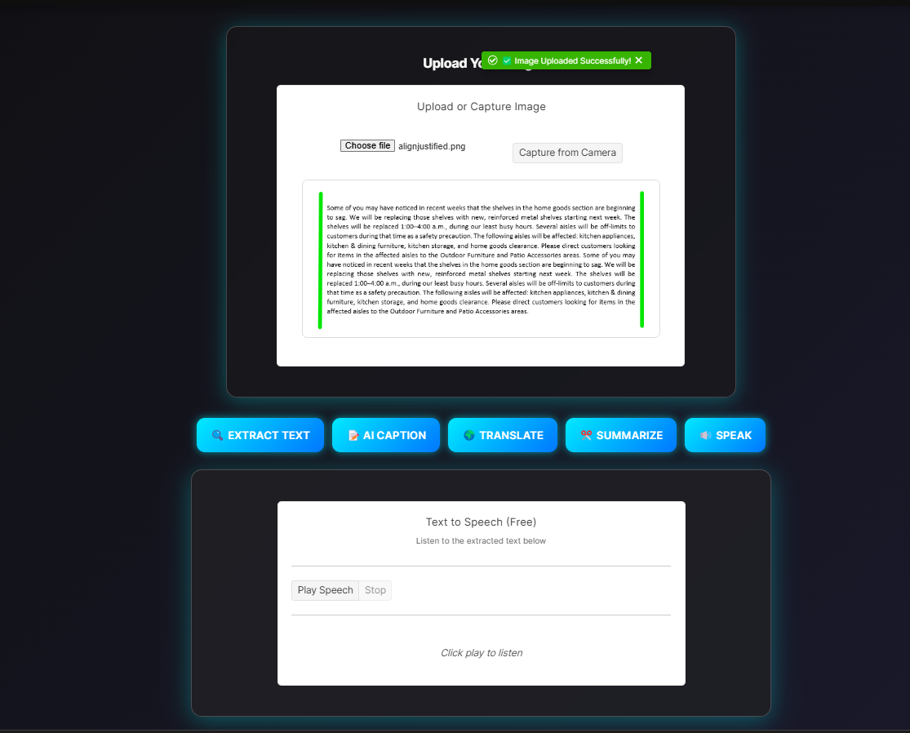

  

# ParseGenieAI
 ParserGenie AI = Upload Image ➔ Extract Perfect Text ➔ Summarize, Fix, Translate, Caption ➔ Download or Copy(yet to be done) — All in a futuristic, playful way.

# 🧙‍♂️ ParserGenie AI — Turn Images into Text with AI-Driven Accuracy

Welcome to **ParserGenie AI**, our submission for the **KendoReact Free Components Challenge**!  
ParserGenie is an AI-powered Image-to-Text web app designed for a futuristic, frictionless user experience — featuring intelligent OCR, smart summarization, translation, caption generation, and text-to-speech functionalities.

---

## 🚀 Live Demo

🔗 [ParserGenie AI Live Demo](https://parsergenie.netlify.app/)  

---

## 📸 What We Built

**ParserGenie** is a genial AI Image-to-Text web app that allows users to:

- ✔️ **Extract text from images** with AI-driven OCR
- ✔️ **Generate AI-powered captions** for better content understanding
- ✔️ **Translate** extracted text into different languages
- ✔️ **Summarize** long text into concise, meaningful insights
- ✔️ **Text-to-Speech output** for accessibility and engagement

---
## 📸 App Screenshots

### 🏠 Home Page

  

---

### 🖼️ Image Upload 

  
  

---

### 🖼️ OCR Extraction

  

---

### ✨ Summarization Output

  

---
### ✍️ AI Caption Generator

  

---

### 🌐 Translation Feature

  

---

### ✨ Summarization Output

  

---

### 🔊 Text-to-Speech Narration

  

---
## 🎯 What Makes It Unique?

- **AI-Powered Functions**  
  Cutting-edge OCR, AI summarization, intelligent translations, and natural speech generation.

- **Cyberpunk UI**  
  Futuristic, minimalist design featuring glassmorphism effects and neon accents.

- **Seamless UX**  
  Fully responsive, mobile-friendly, and intuitive interactions.

- **Powered by KendoReact**  
  Quick, interactive, and beautifully styled UI with production-quality components.

---

## 👥 Ideal For

- **Students** — Instantly summarize lecture notes.
- **Travelers** — Translate signs, menus, and documents.
- **Content Creators** — Generate AI captions for social media.
- **Accessibility Users** — Use text-to-speech for easier content consumption.

---

## 🛠️ Tech Stack

| Area            | Technology |
|-----------------|------------|
| Frontend        | React.js, KendoReact UI Components |
| Backend         | Minimal Node.js/Serverless Functions |
| OCR Engines     | Tesseract.js, Google Vision API, AI OCR |
| AI Services     | OpenAI GPT APIs, Grammarly APIs |
| Styling         | Custom KendoReact Themes + Figma Kits |
| Hosting         | Vercel/Netlify |

---

## 🧩 KendoReact Components Used

- **AppBar** — Top navigation for smooth app experience.
- **Button** — Feature triggers with hover animations.
- **Notification** — Feedback on successful uploads and processing.
- **ProgressBar** — Live visual feedback during AI processing.
- **DropDownList** — Language selection for translation features.
- **TextArea** — Displays extracted text for editing and summarizing.
- **Dialog** — Confirmation and AI-generated summaries.
- **Card** — Displays generated captions and translations cleanly.
- **Tooltip** — Helpful feature hints and definitions.
- **TabStrip** (initially) → replaced by **Buttons** for faster workflow.

---

## 🧠 AIm to Impress — AI-Powered Features

- **OCRTextExtractor** — Smart, multilingual text extraction from images (printed and handwritten).
- **CaptionGenerator** — Creates intelligent AI-based image captions.
- **Translation Engine** — Instantly translates extracted text across languages.
- **Summarization Engine** — Shortens long text into insightful summaries.
- **Text-to-Speech Module** — Converts extracted or translated text into natural speech.

---

## 🎨 Delightfully Designed — UI/UX Features

- ✔️ Neon Cyberpunk Aesthetic  
- ✔️ Smooth Glassmorphism Effects  
- ✔️ Gradient Interactive Buttons  
- ✔️ Fully Responsive for Mobile and Desktop  

The UI isn't just futuristic — it’s fun, functional, and accessible.

---

## 🌍 Real-World Applications

- **Accessibility** — Supports visually impaired users with text-to-speech.
- **Business Productivity** — Extract editable text from physical documents.
- **Language Learning** — Instant translations and summaries for language practice.
- **Content Automation** — Generate captions and summaries for faster content creation.

---

## 💬 Final Thoughts

The **KendoReact Free Components Challenge** encouraged us to explore AI integration, creative UI/UX design, and solving real-world problems — all in one app.

### Key Takeaways:
- KendoReact's powerful components greatly accelerated development.
- AI-driven features made ParserGenie a practical and futuristic tool.
- Creative UI/UX turned the app into a delightful, interactive experience.

---

## 🔮 What's Next?

- Building native AI model support for additional languages.
- Implementing Hybrid OCR for improved accuracy on difficult images.
- Adding multiple theme options for custom UI personalization.

---

## 📂 GitHub Repository

🔗 [GitHub - ParserGenie AI](https://github.com/chotushikari/ParserGenieAI.git)

---

> **ParserGenie AI** — The future of intelligent, accessible technology.

---
